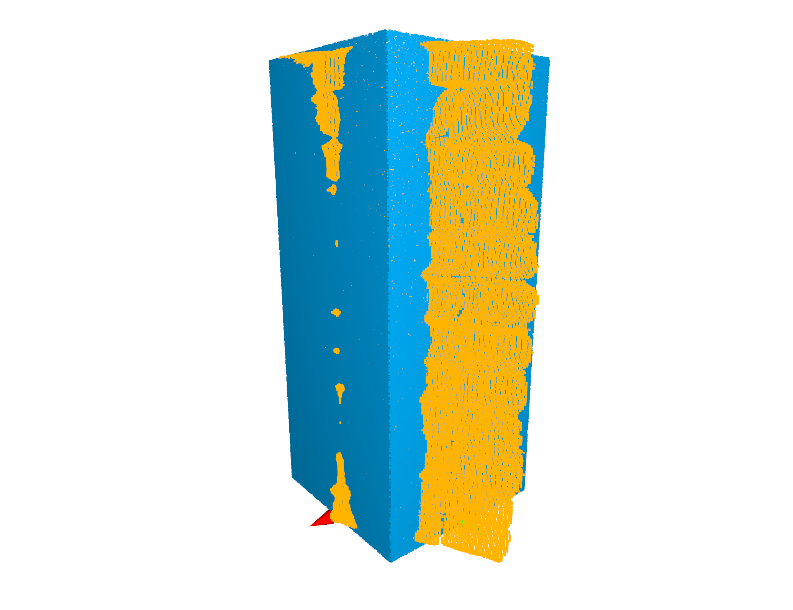

# amm-jenga-play
Jenga play with Franka Reasearch 3 [SKKU 2023 URP Team2's Project]

------
## Members
| [신태하](https://github.com/mirinae3145) | [신현수](https://github.com/Hyun-soo-Shin) | [이윤서](https://github.com/Corinyi) |
| :-: | :-: | :-: |
|  |  |  |

------
## Block Recognition

### Get **RGB Image & Depth Image** from RGB-D Camera (Intel® RealSense™ Depth Camera D435f)
| RGB Image | Depth Image |
| :-: | :-: |
|  |  |

### Get each Block's Mask from RGB Image
| Extract Red | Red Mask | One Block Color | One Block Mask |
| :-: | :-: | :-: | :-: |
|  |  |  |  |

| Blocks Merge | Masks Merge |
| :-: | :-: |
|  |  |

### Get Point Cloud of Jenga Tower / Blocks
| Tower Point Cloud | Block Point Cloud  |
| :-: | :-: |
|  |  |

### Iterative Closest Point Registration (Camera Coordinate System to Mesh Coordinate System)
| Source Point Cloud (Outlier Removed) | Target Point Cloud  |
| :-: | :-: |
|  |  |

| Before ICP | After ICP  |
| :-: | :-: |
|  |  |

### Get Block Coordinate and Target Coordinate (Mesh Coordinate System)
| Source Point Cloud (Outlier Removed) | Target Point Cloud  |
| :-: | :-: |
|  |  |
Estimated Block Center Point (Red) and TCP Target Point (Red)