<!--fr3 machine readme-not including realsense-->

# Amm-Jenga-Play
Jenga play with Franka Reasearch 3 [SKKU 2023 URP Team2's Project]

# How to use
<details><summary>create an instance of Franka Research 3</summary>

```python
import fr3
robot=fr3.fr3()
```
## modifying module
in \_\_init\_\_ method,
```python
URDF_read(
    your_xacro_file,tld=your_root_path,xacro_tld=xacro_root_path
)
```
for gripper changes, in fr3.py
```python
self.grippers[0].tool=SE3(x,y,z)
```
and in franka_description/robots/common/inertial.yaml, change values
```yaml
leftfinger:
    inertia:
        xx: I_xx
        yy: I_yy
        zz: I_zz
```

</details>

<details>
<summary>transform and rotation</summary>

```python
# Rotation
# This is a constant rotation around the x-axis by 90 degrees
rx_cons = rtb.ET.Rx(np.pi / 2)
transform = rx_cons.A()
sm_transform = sm.SE3(transform)
# Make the joint at 45 degrees
rx_var = rtb.ET.Rx()
q = np.pi / 4
transform = rx_var.A(q)
sm_transform = sm.SE3(transform)

# Translation
# This is a constant translation along the y-axis by 25 cm
ty_cons = rtb.ET.ty(0.25)\
transform = ty_cons.A()
sm_transform = sm.SE3(transform)

# Make the joint at 15 cm
ty_var = rtb.ET.ty()
q = 0.15
transform = ty_var.A(q)
sm_transform = sm.SE3(transform)
```
</details>


# Error Control

<details><summary>no attribure 'qplot' error(trajectory.qplot)</summary>

```python
rtb.tools.trajectory.qplot(qt.q, block=False)
```

``` Error code: module 'roboticstoolbox.tools.trajectory' has no attribute 'qplot' ```
- there are class name "Tracjectory" in roboticstoolbox.tools.trajectory
- we can change the the code as follow
- xplot in qplot module in plot module in RTB

```
rtb.tools.plot.xplot(qt.q, block=False)
```

</details>
<details><summary>'xacro' not defined error</summary>

```python
robot=fr3.fr3()
```
``` Error code: name 'xacro' is not defined ```

- it's because of version issue
- trace the xacro file and erase 'xacro.' syntax in code
</details>


# Summary
## 1.1 ETS(Elmentary Transform Sequence)

- ETS : Comporomise many E_i : (Translation and rotations)
- E_i : T translation + T Rotation($\eta$)
    - $\eta$ : c and joint variable q
      - q : $\theta$(evolute joint) + d(prismatic)
<details><summary>15ETS</summary>

``` python
# Example for panda
E1 = rtb.ET.tz(0.333)
E2 = rtb.ET.Rz()
E3 = rtb.ET.Ry()
E4 = rtb.ET.tz(0.316)
E5 = rtb.ET.Rz()
E6 = rtb.ET.tx(0.0825)
E7 = rtb.ET.Ry(flip=True)
E8 = rtb.ET.tx(-0.0825)
E9 = rtb.ET.tz(0.384)
E10 = rtb.ET.Rz()
E11 = rtb.ET.Ry(flip=True)
E12 = rtb.ET.tx(0.088)
E13 = rtb.ET.Rx(np.pi)
E14 = rtb.ET.tz(0.107)
E15 = rtb.ET.Rz()

# We can create and ETS in a number of ways

# Firstly if we use the * operator between two or more ETs, we get an ETS
ets1 = E1 * E2 * E3

# Secondly, we can use the ETS constructor and pass in a list of ETs
ets2 = rtb.ETS([E1, E2, E3])

# We can also use the * operator between ETS' and ETs to concatenate
ets3 = ets2 * E4
ets4 = ets2 * rtb.ETS([E4, E5])
```
</details>

## 1.2 F - Kinematics

- Panda have 7 joint(angle) and 8 static value(length)
- to make joint tranfromatino use below
    <details><summary>code</summary>

    ```python
    q = np.array([0, -0.3, 0, -2.2, 0, 2, 0.79])
    fk = np.eye(4)
    for et in panda:
        if et.isjoint:
            fk = fk @ et.A(q[et.jindex])
        else:
            fk = fk @ et.A()
    print(sm.SE3(fk))
    ```

    

</details>

# Todo&Checklist
Please describe here about what has been done and what to do.
<details><summary>Part1</summary>
<details><summary>porting</summary>

- [x] read xacro
- [x] load yaml
- [x] configure link
- [x] simulate(fr3_test.ipynb)
- [ ] solve real IK
- [ ] verify limit
</details>
<details><summary>translation&rotation</summary>

</details>
<details><summary>collision</summary>

- [ ] basic pybullet practice
- TBD

</details>
</details>

<details><summary>Part 2</summary>
<details><summary>robot management</summary>

- [ ] connect with ros
- [ ] admin site study
</details>
<details><summary>pipeline</summary>

- TBD
</details>
<details><summary>fingertip</summary>

- [ ] 3D design
</details>

</details>

<details><summary>Part 3</summary>

- TBD
</details>

<details><summary>Part 4</summary>

- TBD
</details>


------
## Members
| [신태하](https://github.com/mirinae3145) | [신현수](https://github.com/Hyun-soo-Shin) | [이윤서](https://github.com/Corinyi) |
| :-: | :-: | :-: |
|  |  |  |

------
## Roles
>- **신태하**  
>   - abcde
>   - abcde
>- **이윤서**  
>   - abcde
>   - abcde
>- **신현수**  
>   - abcde
>   - abcde

------
## Block Recognition

### Get **RGB Image & Depth Image** from RGB-D Camera (Azure Kinect DK)
| RGB Image | Depth Image |
| :-: | :-: |
| 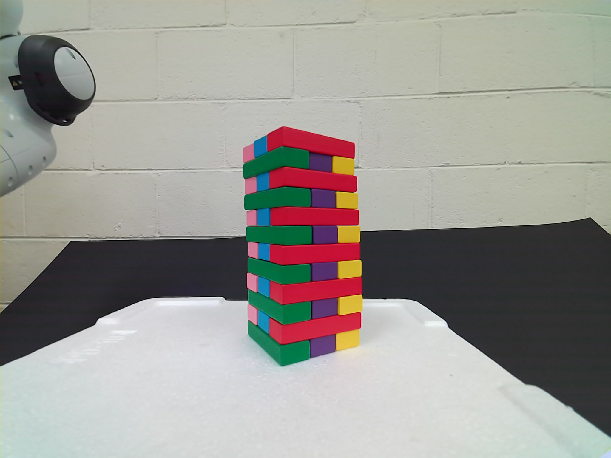 | 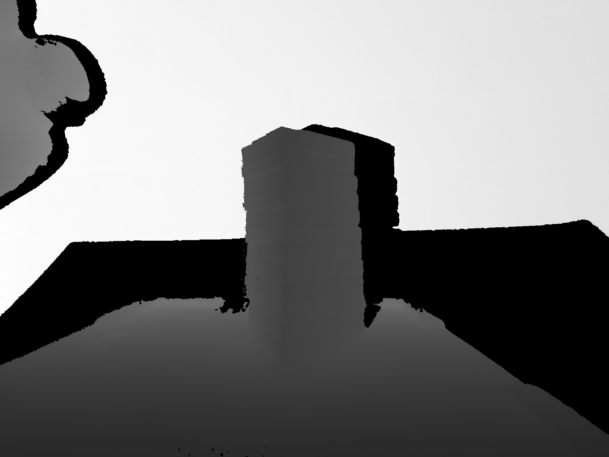 |

### Get each Block's Mask from RGB Image
| Extract Red | Red Mask | One Block Color | One Block Mask |
| :-: | :-: | :-: | :-: |
|  |  |  | 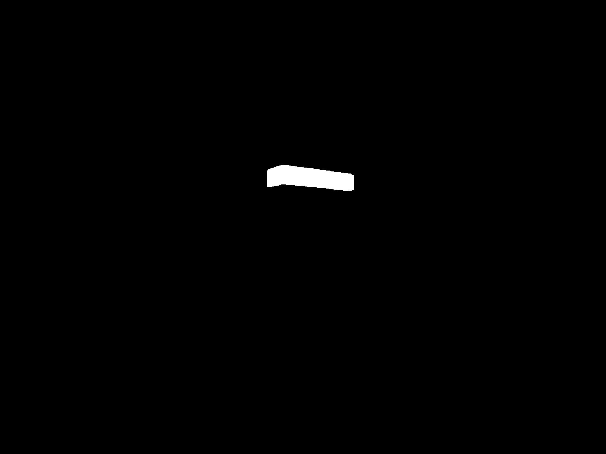 |

| Blocks Merge | Masks Merge |
| :-: | :-: |
| 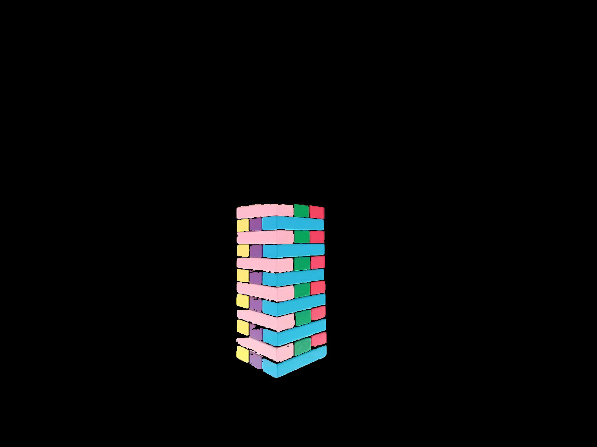 | 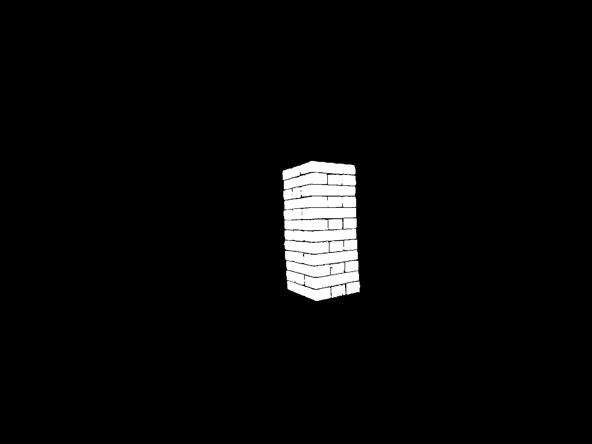 |

### Get Point Cloud of Jenga Tower / Blocks
| Tower Point Cloud | Block Point Cloud  |
| :-: | :-: |
| 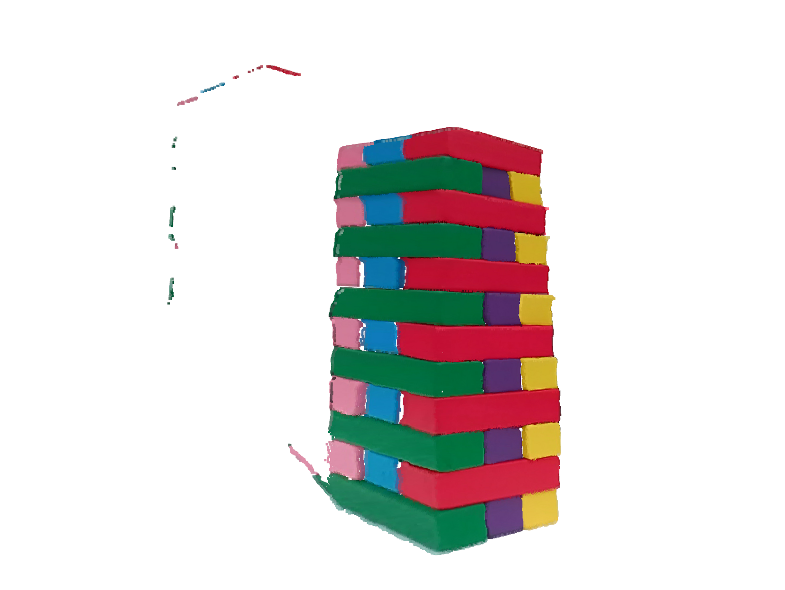 | 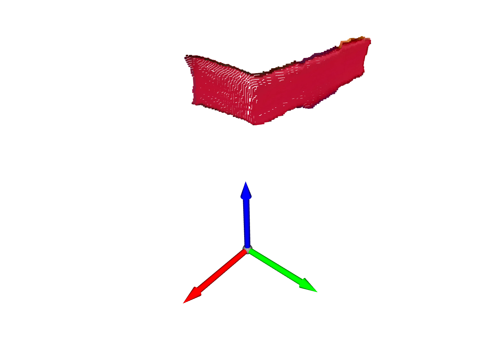 |

### Iterative Closest Point Registration
Use Iterative Closest Point Algorithm to align the Jenga PointCloud from Camera Coordinate System to Jenga Coordinate System (Mesh)

Camera Coordinate System -> Jenga Coordinate System
| Source Point Cloud (Outlier Removed) | Target Point Cloud  |
| :-: | :-: |
| 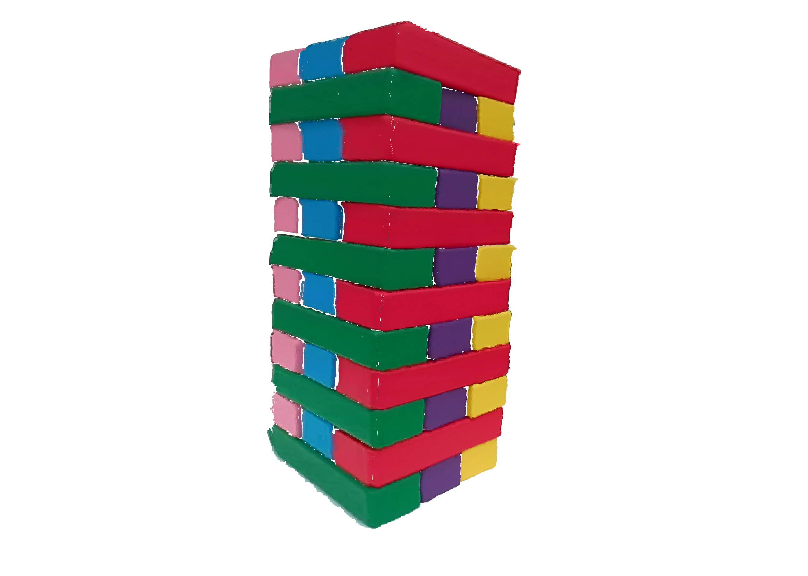 | 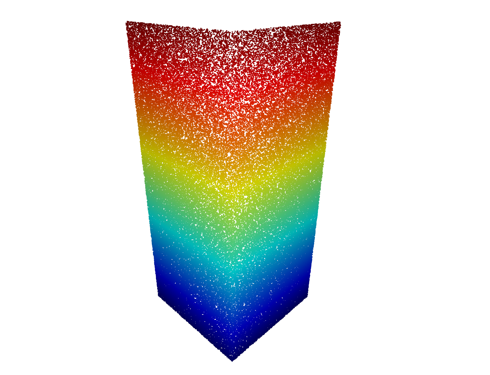 |

| Before ICP | Initial Alignment |  After ICP  |
| :-: | :-: | :-: |
| 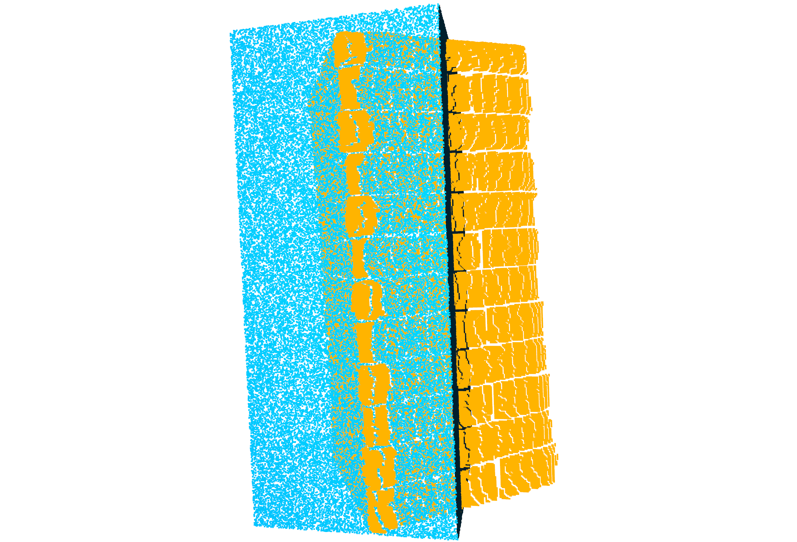 | 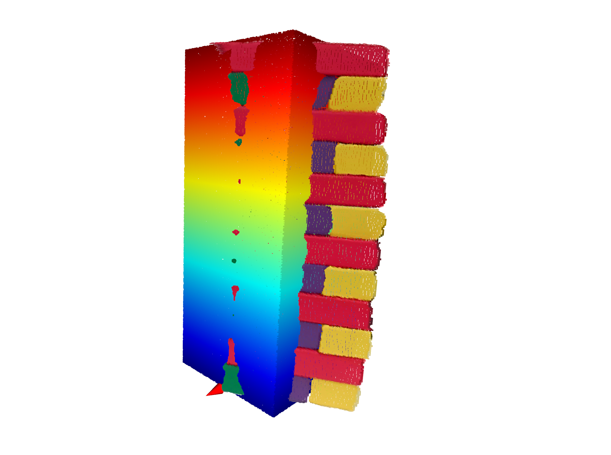 | 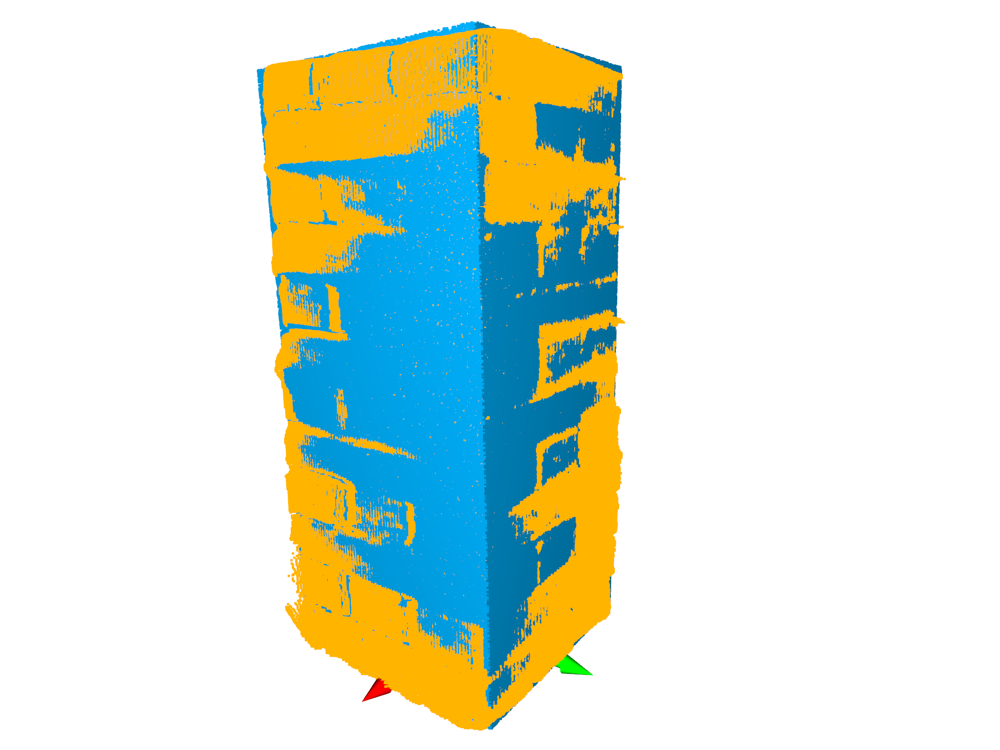 | 

### Estimate Coordinates
Estimate Target Block's Center Coordinate (Red Point), TCP Target Coordinate (Blue Point) (On Jenga Coordinate System)
| Source Point Cloud (Outlier Removed) | Target Point Cloud  |
| :-: | :-: |
| 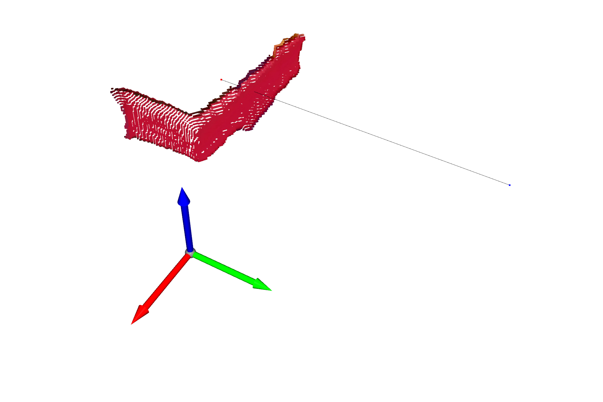 | 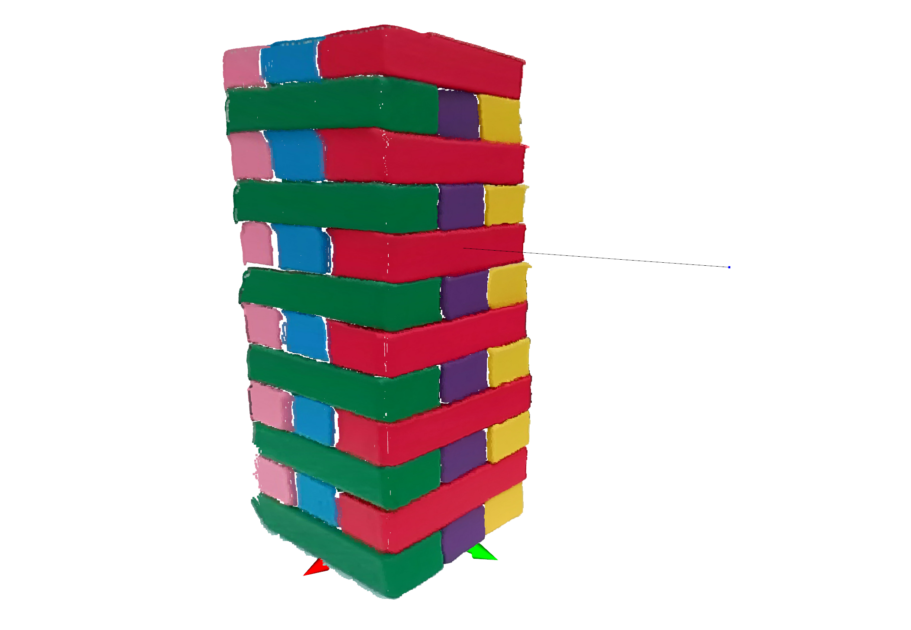 |
Estimated Block Center Point (Red) and TCP Target Point (Red)

